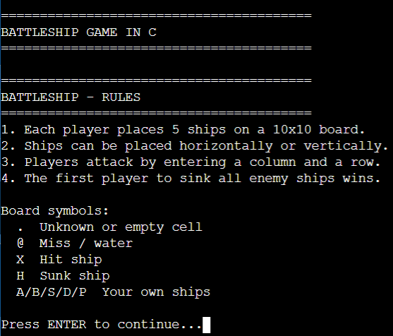
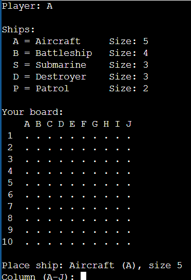
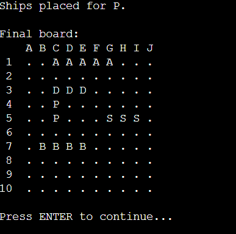
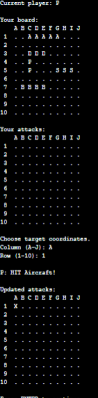
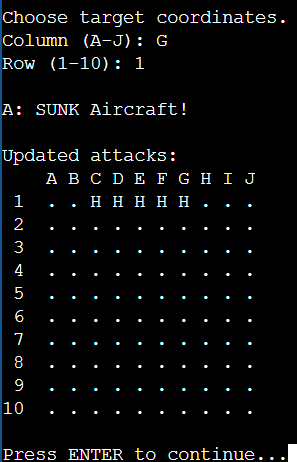
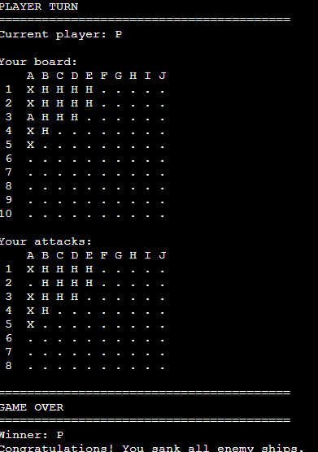

# 🚢 Battleship Game in C


**Battleship Game in C** es una implementación en consola del clásico juego **Batalla Naval / Battleship**, desarrollada en lenguaje **C**.

El proyecto permite que dos jugadores coloquen sus barcos en tableros separados, alternen turnos, realicen disparos, registren impactos, marquen agua, detecten barcos hundidos y determinen un ganador cuando todos los barcos enemigos han sido destruidos.

---

## 📌 Tabla de contenido

* [Descripción](#-descripción)
* [Capturas del juego](#-capturas-del-juego)
* [Características principales](#-características-principales)
* [Tecnologías utilizadas](#-tecnologías-utilizadas)
* [Reglas del juego](#-reglas-del-juego)
* [Simbología del tablero](#-simbología-del-tablero)
* [Tipos de barcos](#-tipos-de-barcos)
* [Estructura lógica del juego](#-estructura-lógica-del-juego)
* [Mecánicas principales](#-mecánicas-principales)
* [Flujo general del programa](#-flujo-general-del-programa)
* [Descripción técnica de funciones](#-descripción-técnica-de-funciones)
* [Cómo compilar y ejecutar](#-cómo-compilar-y-ejecutar)
* [Estructura recomendada del repositorio](#-estructura-recomendada-del-repositorio)
* [Notas de compatibilidad](#-notas-de-compatibilidad)
* [Conceptos aplicados](#-conceptos-aplicados)
* [Mejoras futuras](#-mejoras-futuras)
* [Posibles mejoras técnicas](#-posibles-mejoras-técnicas)
* [Autor](#-autor)
* [Estado del proyecto](#-estado-del-proyecto)

---

## 📖 Descripción

Este proyecto consiste en un juego de **Battleship** desarrollado en lenguaje **C** y ejecutado desde consola.

La dinámica principal consiste en que dos jugadores colocan los barcos en sus respectivos tableros y luego, por turnos, cada uno intenta adivinar la posición de los barcos del oponente ingresando coordenadas de disparo.

El juego maneja:

* Tablero propio de cada jugador.
* Tablero de ataques de cada jugador.
* Colocación manual o automática de barcos.
* Validación de coordenadas.
* Validación de bordes del tablero.
* Control de superposición entre barcos.
* Registro de disparos al agua.
* Registro de barcos tocados.
* Detección de barcos hundidos.
* Alternancia de turnos.
* Condición de victoria.

---

## 🖼️ Capturas del juego


### Pantalla inicial y reglas

<p align="center">
  
</p>

La pantalla inicial muestra el título del juego, las reglas principales y la simbología usada en el tablero.

---

### Colocación de barcos

<p align="center">
  
</p>

Durante la colocación, el jugador puede ver la lista de barcos disponibles y elegir coordenadas usando columnas de `A` a `J` y filas de `1` a `10`.

---

### Tablero final del jugador A

<p align="center">
  
</p>

Después de colocar los barcos, el tablero muestra la posición de cada embarcación con su símbolo correspondiente.

---

### Tablero final del jugador P

<p align="center">
  
</p>

Cada jugador posee su propio tablero de barcos y un tablero separado para registrar ataques al enemigo.

---

### Turno de ataque

<p align="center">
  
</p>

En cada turno se muestra el tablero propio del jugador y el tablero de ataques. El jugador selecciona una coordenada para atacar al enemigo.

---

### Barco hundido

<p align="center">
  
</p>

Cuando todas las partes de un barco son impactadas, el juego muestra un mensaje indicando que el barco fue hundido.

---

### Fin del juego

<p align="center">
  
</p>

El juego termina cuando un jugador hunde todos los barcos enemigos.

---

### Vista compacta

| Reglas                                                             | Colocación                                                                      |
| ------------------------------------------------------------------ | ------------------------------------------------------------------------------- |
|  |  |

| Tablero A                                                                              | Tablero P                                                                              |
| -------------------------------------------------------------------------------------- | -------------------------------------------------------------------------------------- |
|  |  |

| Ataque                                                                            | Hundido                                                                       | Game Over                                                                 |
| --------------------------------------------------------------------------------- | ----------------------------------------------------------------------------- | ------------------------------------------------------------------------- |
|  |  |  |

---

## ✨ Características principales

* Juego de consola desarrollado en **C**.
* Modo para dos jugadores.
* Tablero de tamaño **10x10**.
* Coordenadas con columnas de `A` a `J`.
* Filas de `1` a `10`.
* Colocación manual de barcos.
* Colocación automática opcional.
* Orientación horizontal o vertical.
* Validación para evitar barcos fuera del tablero.
* Validación para evitar superposición de barcos.
* Sistema de turnos alternados.
* Sistema de disparos por coordenadas.
* Detección de agua.
* Detección de impacto.
* Detección de barco hundido.
* Marcado visual del tablero.
* Condición de victoria.
* Código organizado con funciones reutilizables.
* Uso de `struct` para modelar jugadores y barcos.
* Uso de `enum` para representar estados del tablero.

---

## 🛠️ Tecnologías utilizadas

* **Lenguaje C**
* **Consola / Terminal**
* **Matrices bidimensionales**
* **Structs**
* **Enums**
* **Funciones**
* **Condicionales**
* **Ciclos**
* **Entrada y salida estándar**
* **GCC / MinGW / OnlineGDB**

---

## 🎮 Reglas del juego

1. Cada jugador tiene un tablero propio.
2. Cada jugador coloca 5 barcos.
3. Los barcos pueden colocarse de forma horizontal o vertical.
4. No se deben colocar barcos fuera del tablero.
5. No se deben superponer barcos.
6. Los jugadores disparan por turnos.
7. Cada disparo se realiza indicando una columna y una fila.
8. Si el disparo cae sobre una posición ocupada por un barco, se marca como impacto.
9. Si el disparo cae en una posición vacía, se marca como agua.
10. Cuando todas las posiciones de un barco han sido impactadas, se marca como hundido.
11. Gana el jugador que logre hundir todos los barcos del oponente.

---

## 🔣 Simbología del tablero

| Símbolo | Significado                              |
| ------- | ---------------------------------------- |
| `.`     | Casilla vacía, desconocida o sin atacar. |
| `@`     | Agua / disparo fallido.                  |
| `X`     | Barco tocado.                            |
| `H`     | Barco hundido.                           |
| `A`     | Aircraft.                                |
| `B`     | Battleship.                              |
| `S`     | Submarine.                               |
| `D`     | Destroyer.                               |
| `P`     | Patrol.                                  |

---

## 🚢 Tipos de barcos

El juego utiliza cinco tipos de barcos:

| Símbolo | Barco      | Tamaño     |
| ------- | ---------- | ---------- |
| `A`     | Aircraft   | 5 casillas |
| `B`     | Battleship | 4 casillas |
| `S`     | Submarine  | 3 casillas |
| `D`     | Destroyer  | 3 casillas |
| `P`     | Patrol     | 2 casillas |

Estos barcos se modelan con una estructura:

```c
typedef struct {
    char name[NAME_SIZE];
    char symbol;
    int size;
    int hits;
    int sunk;
} Ship;
```

Cada barco guarda:

* Nombre.
* Símbolo.
* Tamaño.
* Cantidad de impactos recibidos.
* Estado de hundido.

---

## 🧩 Estructura lógica del juego

El juego utiliza una estructura `Player` para evitar repetir variables por cada jugador.

```c
typedef struct {
    char name[NAME_SIZE];
    int ownBoard[BOARD_SIZE][BOARD_SIZE];
    int attackBoard[BOARD_SIZE][BOARD_SIZE];
    int shipIndex[BOARD_SIZE][BOARD_SIZE];
    Ship ships[MAX_SHIPS];
} Player;
```

Cada jugador tiene:

* Nombre.
* Tablero propio.
* Tablero de ataques.
* Matriz auxiliar para saber qué barco ocupa cada casilla.
* Lista de barcos.

La lógica general puede representarse así:

```text
Player
 ├── name
 ├── ownBoard
 ├── attackBoard
 ├── shipIndex
 └── ships
      ├── Aircraft
      ├── Battleship
      ├── Submarine
      ├── Destroyer
      └── Patrol
```

Esto es para evitar tener variables para cada jugador y duplicar código como:

```text
grid1position
grid2position
grid1shoot
grid2shoot
ship1
ship2
```

En su lugar, se usa:

```text
player1.ownBoard
player1.attackBoard
player2.ownBoard
player2.attackBoard
```

---

## ⚙️ Mecánicas principales

### 1. Creación del tablero

El tablero se representa mediante una matriz bidimensional de enteros.

```c
int ownBoard[BOARD_SIZE][BOARD_SIZE];
int attackBoard[BOARD_SIZE][BOARD_SIZE];
```

Cada posición del tablero guarda un estado:

```c
typedef enum {
    EMPTY = 0,
    SHIP = 1,
    MISS = 2,
    HIT = 3,
    SUNK = 5
} CellState;
```

---

### 2. Lectura segura de entrada

El programa utiliza `fgets()` en lugar de depender directamente de `scanf()` para reducir problemas con entradas inválidas.

La lectura de texto se maneja con funciones reutilizables:

```c
void readLineOrExit(char *buffer, size_t size);
void readText(const char *message, char *dest, size_t size);
int readIntegerInRange(const char *message, int min, int max);
```

Esto permite validar la entrada del usuario y evitar que el programa se quede detenido si la entrada estándar se cierra.

---

### 3. Coordenadas con letras

Las columnas se leen como letras de `A` a `J`.

```text
A -> 0
B -> 1
C -> 2
...
J -> 9
```

La función encargada de esto es:

```c
int readColumn(void);
```

Las filas se leen como números de `1` a `10` y se convierten internamente a índices de `0` a `9`.

---

### 4. Impresión del tablero

La función `drawBoard()` se encarga de imprimir cualquier tablero.

```c
void drawBoard(
    const char *title,
    const Player *player,
    int board[BOARD_SIZE][BOARD_SIZE],
    int showShips
);
```

Esta función evita repetir código para dibujar:

* El tablero propio.
* El tablero de ataques.
* El tablero final.
* El tablero actualizado después de cada disparo.

---

### 5. Colocación de barcos

Los barcos pueden colocarse manualmente o automáticamente.

La colocación manual usa:

```c
void placeShipsManually(Player *player);
```

La colocación automática usa:

```c
void autoPlaceShips(Player *player);
```

La función `setupPlayerShips()` pregunta al jugador si desea colocar sus barcos automáticamente:

```c
void setupPlayerShips(Player *player);
```

---

### 6. Validación de colocación

Antes de colocar un barco se valida que:

* No salga del tablero.
* No se superponga con otro barco.
* Todas sus casillas estén disponibles.

La función encargada es:

```c
int canPlaceShip(
    const Player *player,
    int shipIndex,
    int row,
    int col,
    Orientation orientation
);
```

---

### 7. Sistema de disparos

Cada turno se ejecuta con:

```c
void playTurn(Player *attacker, Player *defender);
```

Esta función:

1. Muestra el tablero propio del atacante.
2. Muestra su tablero de ataques.
3. Solicita coordenadas.
4. Verifica que esa posición no haya sido atacada antes.
5. Comprueba si el disparo fue agua o impacto.
6. Actualiza ambos tableros.
7. Detecta si el barco fue hundido.

---

### 8. Detección de barco hundido

Cada barco tiene un contador de impactos:

```c
int hits;
```

Cuando el número de impactos es igual al tamaño del barco, se marca como hundido:

```c
if (defender->ships[shipIndex].hits >= defender->ships[shipIndex].size) {
    defender->ships[shipIndex].sunk = 1;
}
```

Luego se actualizan todas las casillas del barco con `H`.

---

### 9. Condición de victoria

La función:

```c
int allShipsSunk(const Player *player);
```

revisa si todos los barcos de un jugador están hundidos.

Si todos están hundidos, el jugador contrario gana.

---

## 🔄 Flujo general del programa

```text
Inicio del programa
   │
   ├── Mostrar título y reglas
   │
   ├── Pedir nombre del jugador 1
   ├── Pedir nombre del jugador 2
   │
   ├── Colocar barcos del jugador 1
   ├── Colocar barcos del jugador 2
   │
   └── Iniciar partida
        │
        ├── Turno jugador 1
        │    ├── Mostrar tablero propio
        │    ├── Mostrar tablero de ataques
        │    ├── Ingresar coordenada
        │    ├── Verificar impacto o agua
        │    ├── Verificar barco hundido
        │    └── Verificar ganador
        │
        ├── Turno jugador 2
        │    ├── Mostrar tablero propio
        │    ├── Mostrar tablero de ataques
        │    ├── Ingresar coordenada
        │    ├── Verificar impacto o agua
        │    ├── Verificar barco hundido
        │    └── Verificar ganador
        │
        └── Mostrar ganador
```

---

## 📦 Descripción técnica de funciones

| Función                | Descripción                                                                 |
| ---------------------- | --------------------------------------------------------------------------- |
| `clearScreen()`        | Limpia la consola usando secuencias ANSI.                                   |
| `waitEnter()`          | Pausa el programa hasta que el usuario presione ENTER.                      |
| `removeNewline()`      | Elimina el salto de línea de una cadena leída con `fgets`.                  |
| `readLineOrExit()`     | Lee una línea de entrada y termina de forma segura si la entrada se cierra. |
| `readText()`           | Lee texto no vacío, como el nombre del jugador.                             |
| `readIntegerInRange()` | Lee un número dentro de un rango válido.                                    |
| `readColumn()`         | Lee una columna de `A` a `J` y la convierte a índice.                       |
| `readRow()`            | Lee una fila de `1` a `10` y la convierte a índice.                         |
| `readOrientation()`    | Lee la orientación del barco: horizontal o vertical.                        |
| `printTitle()`         | Imprime títulos de sección con formato uniforme.                            |
| `printRules()`         | Muestra las reglas y simbología del juego.                                  |
| `printShipLegend()`    | Muestra los barcos disponibles y sus tamaños.                               |
| `initializeShips()`    | Inicializa los barcos de un jugador.                                        |
| `initializePlayer()`   | Inicializa nombre, tableros y barcos de un jugador.                         |
| `boardSymbol()`        | Convierte el valor de una casilla en un carácter visible.                   |
| `drawBoard()`          | Dibuja un tablero en consola.                                               |
| `isInsideBoard()`      | Verifica si una coordenada está dentro del tablero.                         |
| `canPlaceShip()`       | Valida si un barco puede colocarse en una posición.                         |
| `placeShip()`          | Coloca un barco en el tablero.                                              |
| `placeShipsManually()` | Permite colocar todos los barcos manualmente.                               |
| `autoPlaceShips()`     | Coloca barcos automáticamente en posiciones válidas.                        |
| `askYesNo()`           | Lee una respuesta de sí o no.                                               |
| `setupPlayerShips()`   | Configura la flota de un jugador.                                           |
| `markSunkShip()`       | Marca todas las casillas de un barco hundido.                               |
| `allShipsSunk()`       | Verifica si todos los barcos de un jugador fueron hundidos.                 |
| `printShotResult()`    | Muestra el resultado del disparo.                                           |
| `playTurn()`           | Ejecuta un turno completo de ataque.                                        |
| `printWinner()`        | Muestra el ganador de la partida.                                           |
| `main()`               | Controla el flujo principal del juego.                                      |

---

## ▶️ Cómo compilar y ejecutar

### Opción 1: Windows con GCC / MinGW

Si el archivo principal se llama `main.c`, compila con:

```bash
gcc -std=c99 -Wall -Wextra -pedantic main.c -o battleship.exe
```

Luego ejecuta:

```bash
battleship.exe
```

O en PowerShell:

```powershell
.\battleship.exe
```

---

### Opción 2: Linux / macOS

```bash
gcc -std=c99 -Wall -Wextra -pedantic main.c -o battleship
```

Luego:

```bash
./battleship
```

---

### Opción 3: OnlineGDB

1. Entra a OnlineGDB.
2. Selecciona lenguaje **C**.
3. Pega el contenido de `main.c`.
4. Ejecuta con **Run**.
5. Usa la consola interactiva para ingresar los datos del juego.

---

## 📁 Estructura del repositorio

```text
Battleship-C/
│
├── README.md
├── main.c
│
├── screenshots/
│   ├── 01-rules.png
│   ├── 02-ship-placement.png
│   ├── 03-player-a-board.png
│   ├── 04-player-p-board.png
│   ├── 05-attack-turn.png
│   ├── 06-sunk-ship.png
│   └── 07-game-over.png
│
└── versions/
    ├── battleship-version-girl.c
    ├── proyecto-entregat.c
    ├── proyecto-no.2-semestral-hpa1.c
    └── definitivooooooooooooo.c
```

La carpeta `versions/` no es más que versiones anteriores del proyecto, sirve como historial.

---

## ⚠️ Notas de compatibilidad

Esta versión final fue adaptada para ser más portable.

A diferencia de versiones anteriores, no depende de:

```c
#include <conio.h>
```

Tampoco usa:

```c
system("cls");
system("pause");
```

En su lugar, utiliza:

```c
printf("\033[2J\033[H");
```

para limpiar pantalla y funciones propias para pausar la ejecución.

Esto permite que el programa pueda ejecutarse mejor en:

* Windows.
* Linux.
* macOS.
* OnlineGDB.
* Terminal integrada de VS Code.

---

## 🧠 Conceptos aplicados

Este proyecto permite practicar conceptos importantes de programación en C:

* Matrices bidimensionales.
* Funciones.
* Constantes.
* Ciclos `for` y `while`.
* Condicionales `if`, `else` y `switch`.
* Entrada de datos con `fgets`.
* Conversión de cadenas con `strtol`.
* Validación de datos.
* Estructuras `struct`.
* Enumeraciones `enum`.
* Punteros a estructuras.
* Modularización de lógica.
* Control de turnos.
* Modelado de estados mediante números.
* Simulación de tablero.
* Diseño de juego por consola.
* Manejo de coordenadas.
* Detección de impacto.
* Condición de victoria.

---

## 🧪 Ejemplo de representación del tablero

```text
   A B C D E F G H I J
 1 A B S D P . . . . .
 2 A B S D P . . . . .
 3 A B S D . . . . . .
 4 A B . . . . . . . .
 5 A . . . . . . . . .
```

Otro ejemplo durante ataques:

```text
   A B C D E F G H I J
 1 X H H H H . . . . .
 2 @ . . . . . . . . .
 3 . . . X . . . . . .
```

Simbología:

```text
. = vacío o desconocido
@ = agua
X = tocado
H = hundido
A/B/S/D/P = barcos propios
```

---

## 🚧 Mejoras futuras

Algunas mejoras que se pueden implementar son:

* Agregar menú principal.
* Agregar opción de reiniciar partida.
* Agregar modo jugador contra computadora.
* Agregar dificultad para la computadora.
* Agregar disparos inteligentes para la computadora.
* Agregar colores en consola.
* Agregar contador de barcos restantes.
* Agregar historial de disparos.
* Agregar opción para guardar partidas.
* Agregar opción para cargar partidas.
* Agregar límite de disparos.
* Agregar validación para nombres demasiado largos.
* Agregar archivo `Makefile`.
* Separar el código en archivos `.h` y `.c`.
* Agregar pruebas manuales documentadas.
* Crear una versión gráfica en otro lenguaje.

---

## 🔍 Posibles mejoras técnicas

Además de las mejoras jugables, se pueden mejorar algunos aspectos internos del código:

* Separar el código en módulos:

  * `board.c`
  * `ship.c`
  * `player.c`
  * `game.c`
  * `main.c`
* Crear archivos de cabecera `.h`.
* Agregar pruebas unitarias para validaciones.
* Mejorar la limpieza de pantalla para terminales que no soporten ANSI.
* Agregar colores ANSI opcionales.
* Agregar un modo sin limpieza de pantalla para depuración.
* Guardar configuraciones del juego en constantes.
* Documentar cada función en formato Doxygen.
* Crear un release con ejecutable compilado.
* Agregar capturas adicionales del juego.

---

## 🧱 Posible refactorización futura

Una versión más modular podría organizarse así:

```text
src/
├── main.c
├── board.c
├── board.h
├── ship.c
├── ship.h
├── player.c
├── player.h
├── game.c
└── game.h
```

Esto permitiría dividir responsabilidades:

| Archivo    | Responsabilidad                            |
| ---------- | ------------------------------------------ |
| `board.c`  | Dibujar y administrar tableros.            |
| `ship.c`   | Manejar barcos y validaciones de posición. |
| `player.c` | Manejar datos del jugador.                 |
| `game.c`   | Controlar turnos, disparos y ganador.      |
| `main.c`   | Punto de entrada del programa.             |

---

## 👨‍💻 Autor

**Paulo Salazar**

* GitHub: [@SalazarPaulo](https://github.com/SalazarPaulo)

---

## 📄 Licencia

Este proyecto fue desarrollado con fines académicos y de aprendizaje.

Si deseas reutilizar, modificar o distribuir este proyecto, se recomienda agregar una licencia formal al repositorio.

---

## 📌 Estado del proyecto

Proyecto académico desarrollado en lenguaje **C** para practicar lógica de programación, matrices, funciones, estructuras, enumeraciones, validaciones, turnos y simulación de un juego de Battleship en consola.

Esta versión representa una versión final combinada, estable y comentada, construida a partir de distintas versiones anteriores del proyecto.
